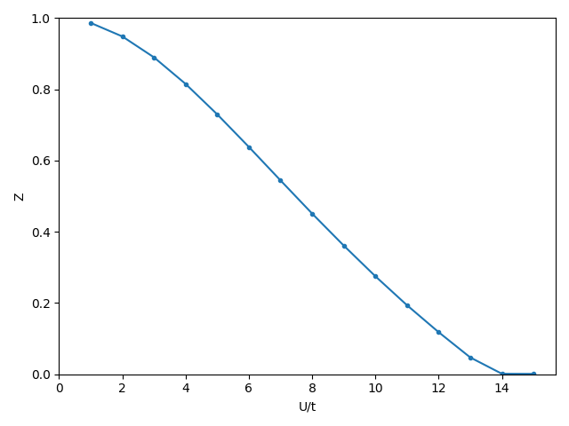

.. _example_triangular_triqs:

Single-Orbital Hubbard Model (Triangular Lattice via TRIQS)
===========================================================

**Script:** ``examples/Triangular_TRIQS_1orb.py``

This example solves the single-orbital Hubbard model on the two-dimensional
triangular lattice, a canonical frustrated-geometry system.
The tight-binding model is constructed with TRIQS's ``TBLattice`` class,
which generates the Hamiltonian :math:`H(\mathbf{k})` on an explicit
Brillouin-zone mesh.
As in the Bethe-lattice example (see :ref:`example_bethe_1orb`), we track the
quasiparticle weight :math:`Z` as a function of the Hubbard interaction
:math:`U` at half filling, using spin SU(2) symmetry to keep the solution
paramagnetic throughout the sweep.

Setup
-----

We import the standard GEM modules together with TRIQS's tight-binding class::

    import numpy as np
    import matplotlib.pyplot as plt
    from triqs.lattice.tight_binding import TBLattice
    from gem.fragment import Fragment
    from gem.lattice import Lattice
    from gem.solvers.simple_ed import SimpleED

The triangular lattice is defined by two primitive vectors in Cartesian
coordinates and nearest-neighbor hopping amplitude :math:`t = 1`::

    a1 = np.array([1.0, 0.0, 0.0])
    a2 = np.array([0.5, np.sqrt(3.0) / 2.0, 0.0])
    t  = 1.0

    H_t = TBLattice(
        units=[a1, a2],
        hoppings={
            (+1,  0): [[-t]],
            (-1,  0): [[-t]],
            ( 0, +1): [[-t]],
            ( 0, -1): [[-t]],
            (+1, -1): [[-t]],
            (-1, +1): [[-t]],
        }
    )

A uniform :math:`64 \times 64` k-mesh is generated from the ``TBLattice``
object and the Hamiltonian is evaluated at each k-point.
The spin degree of freedom is added by tensoring with the
:math:`2 \times 2` identity matrix so that each orbital carries two spins::

    Nk    = 64
    kmesh = H_t.get_kmesh((Nk, Nk, 1))
    kpts  = np.array(list(kmesh.values()))

    # shape: (Nk^2, 2, 2)  — one 2x2 block per k-point (1 orbital x 2 spins)
    Hk_list = np.array([np.kron(H_t.fourier(k), np.eye(2)) for k in kpts])

    lattice = Lattice(Hk_list)

The fragment is set up with :math:`B = 3` bath sites per spin, giving
``nimp = 2`` impurity levels (one per spin) and ``nbath = 6`` bath levels::

    nimp, B   = 2, 3
    nbath     = nimp * B
    ntot      = nimp + nbath

Self-consistency loop
---------------------

For each value of :math:`U` the local Hamiltonian and interaction tensor are
built, a ``SimpleED`` solver is instantiated, and the ghost-GA equations are
iterated to convergence.
Because the triangular lattice is frustrated and the chemical potential can
drift away from half filling during the self-consistency, the code fits
:math:`\mu` on the fly whenever the impurity filling deviates from the target
:math:`n = 1`::

    fit_mu   = True
    n_target = 1.0          # half filling: one electron per site
    mu       = 0.0

    for U in U_list:
        eloc         = np.diag([-U/2, -U/2])
        Utensor      = np.zeros((nimp,)*4)
        Utensor[0, 0, 1, 1] = Utensor[1, 1, 0, 0] = U

        solver   = SimpleED(ntot, use_Ntot=True, use_Sz=True,
                            N_sector=ntot//2, Sz_sector=0,
                            dtype=np.complex128)
        fragment = Fragment(nimp, nbath, eloc, Utensor, solver,
                            Lambda=Lambda0, R=R0, verbose=2)

        for it in range(itmax):
            lattice.solve_qp([fragment], T=T)
            fragment.update_hybridization(T=T)
            fragment.impose_spin_SU2_symmetry()

            fragment.solve_impurity(mu, T=T, num_eig=10, spin_pen=spin_pen)

            # adjust mu to maintain half filling
            if abs(fragment.nfill - n_target) > 1e-3 and fit_mu:
                mu = lattice.fit_mu(n_target, [fragment], T=T,
                                    mu_old=mu, mode='imp', ntol=1e-4)

            Lambda_old, R_old = fragment.Lambda.copy(), fragment.R.copy()
            fragment.update_self_energy(T=T)
            fragment.impose_spin_SU2_symmetry()

            # convergence check in the eigenframe of Lambda
            L_eval_new, UL_new = np.linalg.eigh(fragment.Lambda[::2, ::2])
            L_eval_old, UL_old = np.linalg.eigh(Lambda_old[::2, ::2])
            diff = max(
                np.abs(np.abs(UL_old @ R_old[::2, ::2])
                       - np.abs(UL_new @ fragment.R[::2, ::2])).max(),
                np.abs(L_eval_new - L_eval_old).max(),
            )

            fragment.Lambda = (1 - mix)*fragment.Lambda + mix*Lambda_old
            fragment.R      = (1 - mix)*fragment.R      + mix*R_old
            fragment.impose_spin_SU2_symmetry()

            if diff < tol and it > 2:
                break

        Z_list.append(fragment.compute_Z()[0, 0].real)
        # warm-start next U from current converged solution
        Lambda0, R0 = fragment.Lambda.copy(), fragment.R.copy()

Once the lattice information is encoded in the lattice object, the self-consistency loop is similar to the Bethe-lattice case.
The absence of particle-hole symmetry in this case require the chemical potential to be adjusted on the fly to maintain half filling.
We do that by calling the ``fit_mu`` method of the lattice object whenever the impurity filling deviates from the target by more than a certain threshold (e.g., 0.001).

Results
-------

Plotting the quasiparticle weight :math:`Z` as a function of :math:`U`
reveals the Mott metal-insulator transition on the triangular lattice::

    plt.figure()
    plt.plot(U_list, Z_list,marker='.')
    plt.ylabel('Z')
    plt.xlabel('U/t')
    plt.xlim(0,None)
    plt.ylim(0,1)
    plt.tight_layout()
    plt.savefig(f'trZ_vs_U_B{B}.png', dpi=100)
    plt.show()

As :math:`U` increases from zero the quasiparticle weight decreases
continuously from 1 toward 0, marking the gradual loss of coherence
before the insulating state is reached.
The frustrated geometry of the triangular lattice shifts the critical
interaction to a larger value compared to the Bethe-lattice result,
and the ghost-GA treatment (:math:`B = 3`) captures the correct
shape of the :math:`Z(U)` curve more accurately than the standard
Gutzwiller approximation (:math:`B = 1`).

