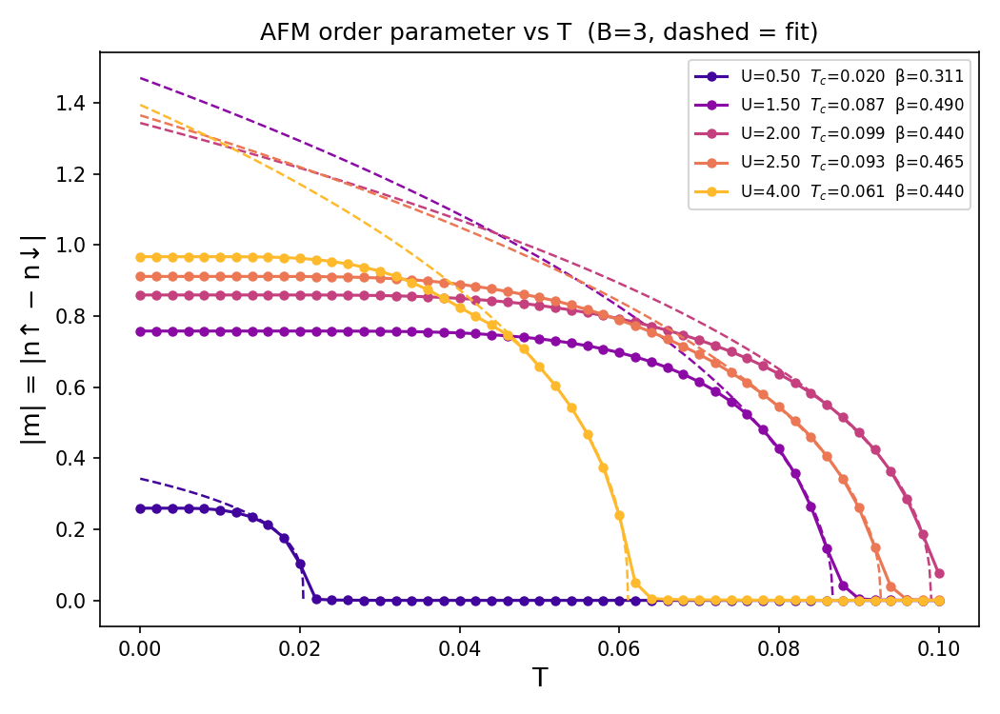
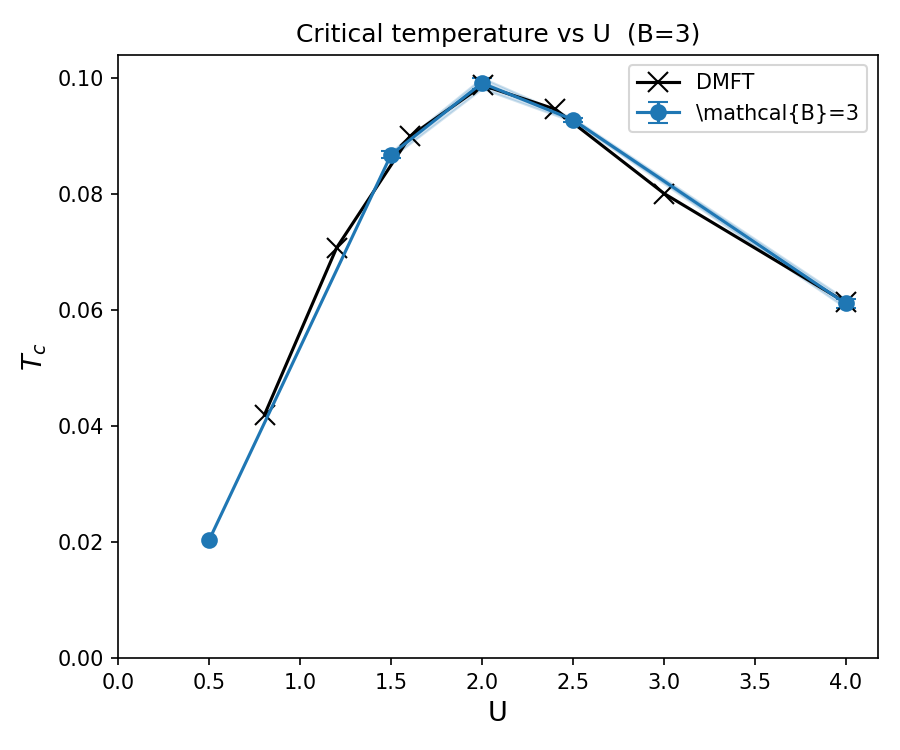
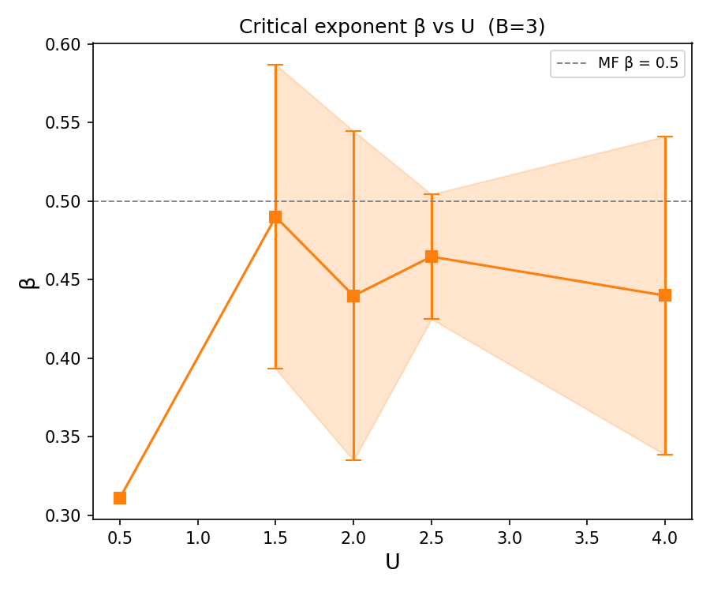

.. _example_square_phase:

Square Lattice — AFM Phase Diagram (Finite Temperature)
=======================================================

**Script:** ``examples/Square_1orb_2frag_phase.py``

**Plotting:** ``examples/plot_phase_B3.py``

This example maps out the finite-temperature antiferromagnetic (AFM)
phase diagram of the single-orbital Hubbard model on the square lattice.
For each value of :math:`U`, the staggered magnetisation :math:`|m|` is
tracked as a function of temperature :math:`T`, sweeping from low to
high :math:`T` on a uniform grid.  The result is a dataset from which
the critical temperature :math:`T_c(U)` can be extracted, tracing the
boundary between the AFM ordered phase and the paramagnetic phase in the
:math:`(U, T)` plane.

Setup
-----

We import the necessary modules::

    import numpy as np
    from gem.fragment import Fragment
    from gem.lattice  import Lattice
    from gem.solvers.simple_ed import SimpleED
    import h5py

The square-lattice setup follows the same structure as
:ref:`example_square_afm`::

    B     = 3
    nimp  = 2
    nbath = nimp * B
    ntot  = nimp + nbath

    Nk = 200
    Kx = np.linspace(-np.pi, np.pi, Nk, endpoint=False)
    Ky = np.linspace(-np.pi, np.pi, Nk, endpoint=False)
    t  = 0.25

    ek_list = []
    for kx in Kx:
        for ky in Ky:
            gamma_k = -t * (1.0
                        + np.exp(-1j * (kx + ky))
                        + np.exp(-1j * ky)
                        + np.exp(-1j * kx))
            Hk_spinless = np.array([[0.0, gamma_k],
                                    [gamma_k.conj(), 0.0]], dtype=np.complex128)
            ek_list.append(np.kron(Hk_spinless, np.eye(2)))

    eks = np.array(ek_list)
    wks = np.ones(len(ek_list)) / len(ek_list)
    lattice = Lattice(eks, wk_list=wks)

The interaction and temperature grids are::

    U_list = np.array([0.5, 1.5, 2.0, 2.5, 4.0])
    T_list = np.linspace(0, 0.10, 51)

    mag_grid = np.zeros((len(U_list), len(T_list)))

Results are accumulated in ``mag_grid[iU, iT]`` = :math:`|m_A|`, the
staggered order parameter on sublattice A.

Initial guess
-------------

The bath parameters are initialised with a staggered spin-splitting to
seed the AFM solution::

    L_t0  = np.kron(np.tanh(np.diag(np.linspace(-1, 1, B+1, endpoint=False)[1:])),
                    np.eye(2))
    L_t0A = L_t0 + 1e-1 * np.kron(np.eye(B), np.diag([1.0, -1.0]))
    L_t0B = -L_t0A
    R_t0  = np.kron(np.ones((B, 1)) / np.sqrt(B), np.eye(2))

``L_t0`` provides a bath with spread energy levels via a ``tanh`` profile.
The small perturbation ``1e-1 * diag([1, -1])`` introduces opposite
spin-splittings on the two sublattices A and B, breaking the symmetry
and stabilising the AFM solution from the first iteration.

Seeding AFM order
-----------------

In addition to the asymmetric initial guess, a weak symmetry-breaking
field ``bfield = 1e-2`` is applied to the local levels only at the
**lowest temperature point** for the first few self-consistency
iterations::

    if iT == 0 and it < 3:
        fragmentA.eloc = eloc + bfield * np.diag([-1,  1])
        fragmentB.eloc = eloc - bfield * np.diag([-1,  1])
    else:
        fragmentA.eloc = eloc.copy()
        fragmentB.eloc = eloc.copy()

This is sufficient because the warm-start strategy (see below) propagates
the ordered solution from one temperature to the next without requiring a
bias field at each :math:`T`.

Warm-starting across temperatures
----------------------------------

The converged variational parameters :math:`R`, :math:`\Lambda`,
:math:`D`, and :math:`\Lambda_c` from one temperature point are used as
the initial guess for the next.  This dramatically reduces the number of
iterations needed near the transition and allows the ordered solution to
survive into the high-:math:`T` regime until it is destabilised by
thermal fluctuations::

    Lambda_A, R_A = L_t0A.copy(), R_t0.copy()
    Lambda_c_A, D_A = L_t0A.copy(), R_t0.copy()
    Lambda_B, R_B = L_t0B.copy(), R_t0.copy()
    Lambda_c_B, D_B = L_t0B.copy(), R_t0.copy()

    for iT, T in enumerate(T_list):
        fragmentA = Fragment(..., Lambda=Lambda_A, R=R_A,
                             Lambda_c=Lambda_c_A, D=D_A)
        fragmentB = Fragment(..., Lambda=Lambda_B, R=R_B,
                             Lambda_c=Lambda_c_B, D=D_B)

        # ... self-consistency loop ...

        Lambda_A, R_A = fragmentA.Lambda.copy(), fragmentA.R.copy()
        Lambda_c_A, D_A = fragmentA.Lambda_c.copy(), fragmentA.D.copy()
        Lambda_B, R_B = fragmentB.Lambda.copy(), fragmentB.R.copy()
        Lambda_c_B, D_B = fragmentB.Lambda_c.copy(), fragmentB.D.copy()

Enforcing magnetisation along the z-axis
-----------------------------------------

To ensure that the magnetisation is purely along the z-axis the
spin-off-diagonal elements of :math:`R`, :math:`\Lambda`, :math:`D`,
and :math:`\Lambda_c` are zeroed at every iteration::

    for fragment in [fragmentA, fragmentB]:
        fragment.R[::2, 1::2] = 0.0;  fragment.R[1::2, ::2] = 0.0
        fragment.Lambda[::2, 1::2] = 0.0;  fragment.Lambda[1::2, ::2] = 0.0
        fragment.D[::2, 1::2] = 0.0;  fragment.D[1::2, ::2] = 0.0
        fragment.Lambda_c[::2, 1::2] = 0.0;  fragment.Lambda_c[1::2, ::2] = 0.0

The :math:`R` and :math:`\Lambda` projections are applied before
``lattice.solve_qp``; the :math:`D` and :math:`\Lambda_c` projections are
applied after ``update_hybridization``.

Convergence criterion
----------------------

The self-consistency loop is considered converged when the combined
residual::

    diff = max(diff_LR, 10 * diff_A, 10 * diff_B)

falls below ``tol = 1e-3``.  Here ``diff_LR`` is the maximum change in
:math:`\Lambda` and :math:`|R|` across both fragments, while ``diff_A``
and ``diff_B`` are the changes in the staggered magnetisation on each
sublattice.  The factor of 10 gives extra weight to magnetisation
convergence, which is the physically relevant order parameter.

Storing results
---------------

After each :math:`U` is completed, the full one-body density matrix,
the variational parameters :math:`R` and :math:`\Lambda`, and the
quasiparticle weight :math:`Z` for both fragments are written to an
HDF5 file, one group per :math:`U` value::

    with h5py.File(f'data_Square_1orb_2frag_B{B}_phase.h5', 'a') as h5f:
        grp = h5f.create_group(f'U{U:.2f}_B{B}')
        grp.create_dataset('T_list',   data=T_list)
        grp.create_dataset('denMat_A', data=arr_denMat_A)  # shape (nT, nimp, nimp)
        grp.create_dataset('denMat_B', data=arr_denMat_B)
        grp.create_dataset('R_A',      data=arr_R_A)       # shape (nT, nbath, nimp)
        grp.create_dataset('R_B',      data=arr_R_B)
        grp.create_dataset('Lambda_A', data=arr_Lambda_A)  # shape (nT, nbath, nbath)
        grp.create_dataset('Lambda_B', data=arr_Lambda_B)
        grp.create_dataset('Z_A',      data=arr_Z_A)       # shape (nT, nimp, nimp)
        grp.create_dataset('Z_B',      data=arr_Z_B)

Each group is flushed to disk as soon as the :math:`U` sweep completes,
so partial runs are not lost if the script is interrupted.  The file is
opened in append mode (``'a'``), which lets successive runs with
different :math:`U` values accumulate in the same file without
overwriting completed groups.

Mean-field criticality fit
---------------------------

The companion script ``plot_phase_B3.py`` reads the HDF5 file and fits
the mean-field order-parameter form

.. math::

   |m(T)| = A\,(T_c - T)^{\beta}

to the magnetisation near each critical temperature.  The fit is
restricted to the critical region, excluding both the low-:math:`T`
saturated regime and the high-:math:`T` noise floor.  It produces three
output figures:

- ``B3_mag_vs_T.png`` — :math:`|m(T)|` for all :math:`U` values with
  the MF fits overlaid as dashed lines.
- ``B3_Tc_vs_U.png`` — the critical temperature :math:`T_c(U)` with
  fit uncertainties shown as error bars and a shaded ±1σ band.
- ``B3_beta_vs_U.png`` — the fitted exponent :math:`\beta(U)` with
  error bars and the mean-field reference :math:`\beta = 1/2`.

Results
-------

The order parameter :math:`|m|` as a function of temperature for
different values of :math:`U` is shown below.  The critical temperature
:math:`T_c` increases and reaches a maximum for :math:`U \approx 2.0` across the range studied.

The critical temperatures :math:`T_c(U)` are shown below together with data extracted from DMFT.
We can see clearly that already :math:`B=3` reproduces faithfully the AFM dome of DMFT.

The fitted exponent :math:`\beta(U)` are shown below.
The extracted values are consistent with the mean-field value :math:`\beta = 1/2`,
apart from the small interaction :math:`U=0.5` where there are few points to fit.
This is expected for a ghost-GA calculation since it reproduces the DMFT critical behavior

